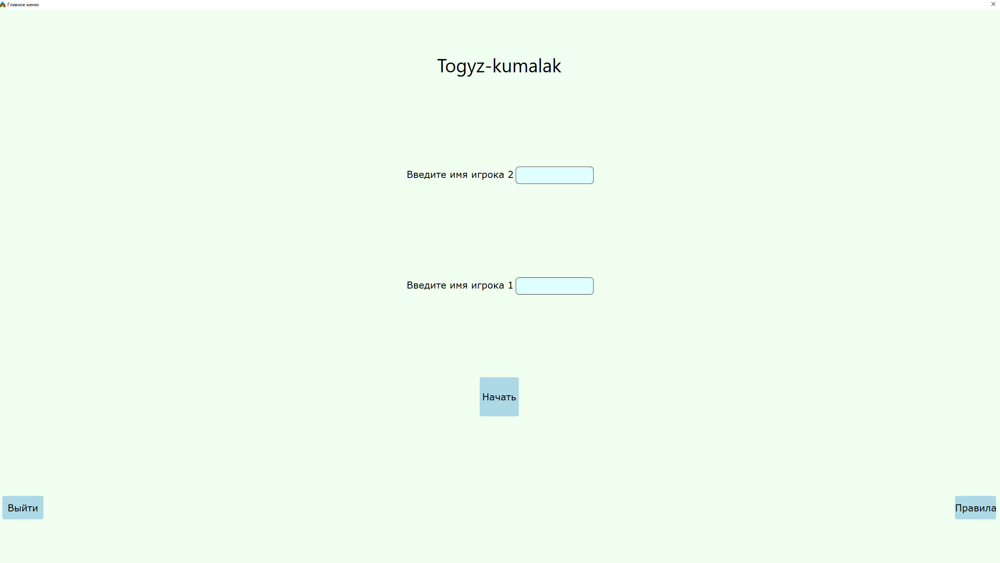
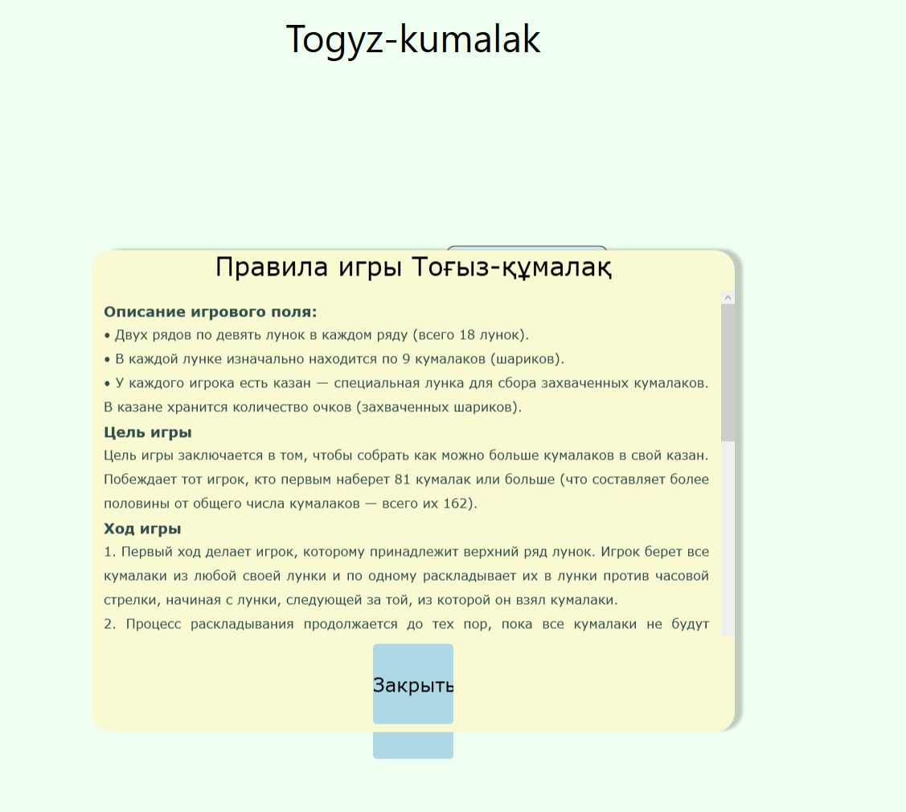
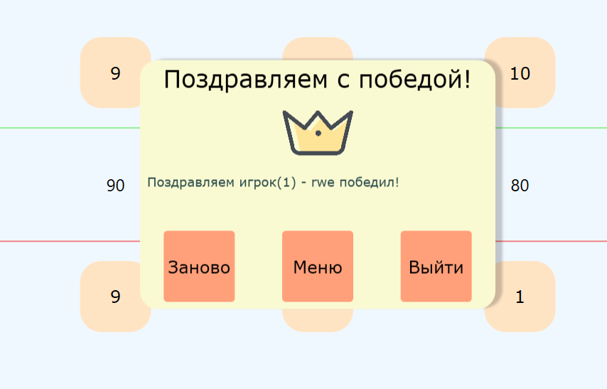

# Тогызкумалак

Проект представляет собой десктопную версию игры "Тогызкумалак", выполненную на C# с использованием WPF.

## Описание игры

Тогызкумалак — традиционная казахская настольная игра, в которой два игрока по очереди делают ходы, распределяя камни по игровым ячейкам. Цель игры — набрать больше очков, чем соперник, заполнив свой кошелек.

## Как запустить проект

1. Клонируйте репозиторий:
    git clone https://github.com/NikitaDiachkov/tugizkumalakUI.git

2. Перейдите в папку с проектом:
    cd tugizkumalakUI

3. Соберите проект через Visual Studio или используйте команду:
    dotnet build

4. Запустите проект:
    dotnet run

## Скриншоты

Вот как выглядит интерфейс игры:

  - Меню
  - Правила
  - Процесс игры
  - Объявление победителя

## Примечания

Игру делал ещё в недалеком 2024 году в Октябре, по желанию преподователя, на тот момент были баги, но вполне возможно они были исправлены. Есть идеи что можно было бы добавить в ней, но сейчас занят другими проектами. По этому имеем что имеем.
По этому такое маленькое и кривое описание.

## Важные моменты

1. Первый ход выбирается рандомным образом.

## Лицензия

MIT License

Copyright (c) 2025 Nikita

Permission is hereby granted, free of charge, to any person obtaining a copy
of this software and associated documentation files (the "Software"), to deal
in the Software without restriction, including without limitation the rights
to use, copy, modify, merge, publish, distribute, sublicense, and/or sell
copies of the Software, and to permit persons to whom the Software is
furnished to do so, subject to the following conditions:

The above copyright notice and this permission notice shall be included in all
copies or substantial portions of the Software.

THE SOFTWARE IS PROVIDED "AS IS", WITHOUT WARRANTY OF ANY KIND, EXPRESS OR
IMPLIED, INCLUDING BUT NOT LIMITED TO THE WARRANTIES OF MERCHANTABILITY,
FITNESS FOR A PARTICULAR PURPOSE AND NONINFRINGEMENT. IN NO EVENT SHALL THE
AUTHORS OR COPYRIGHT HOLDERS BE LIABLE FOR ANY CLAIM, DAMAGES OR OTHER
LIABILITY, WHETHER IN AN ACTION OF CONTRACT, TORT OR OTHERWISE, ARISING FROM,
OUT OF OR IN CONNECTION WITH THE SOFTWARE OR THE USE OR OTHER DEALINGS IN THE
SOFTWARE.